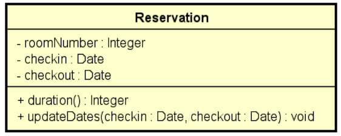

# Udemy - Java Completo 2023 - Sistema de Reserva

Esta é uma solução para o Exercício de Fixação do curso Java Orientado a Ojeto.  

## Índice

- [Visão geral](#overview)
  - [Captura de tela](#screenshot)
  - [Links](#links)
- [Meu processo](processo #my)
  - [Construído com](#built-com)
- [Autor](#author)

## Overview

### Screenshot

### Links

- Solution URL: [Add solution URL here](https://github.com/FelipeMT21/exceptions1-java)

## Meu processo

### Construído com

- Programação Orientada a Objetos (POO) em Java.
- Tratamento de exceções com a classe Exception e o lançamento de exceções personalizadas com a classe DomainException.
- Estruturas de controle de fluxo, como if/else e try/catch.
- Classes e herança de classes com a classe Reservation e sua superclasse Object.
- Sobrescrita de métodos com o método toString() na classe Reservation.
- Polimorfismo com o tratamento de exceções personalizadas na classe Program.
- Entrada e saída de dados com a classe Scanner e o tratamento de exceções com ParseException.
- Manipulação de strings com o método SimpleDateFormat.format() na classe Reservation e String.format() na classe Program.

## Autor

- Website - [João Felipe - Development Software](https://felipemt21.github.io/curriculo/)
- Mentor Frontend - [@FelipeMT21](https://www.frontendmentor.io/profile/FelipeMT21)
- Linkedin - [João Felipe](https://www.linkedin.com/in/jo%C3%A3o-felipe-1028aa210/)
- GitHub - [FelipeMT21](https://github.com/FelipeMT21)